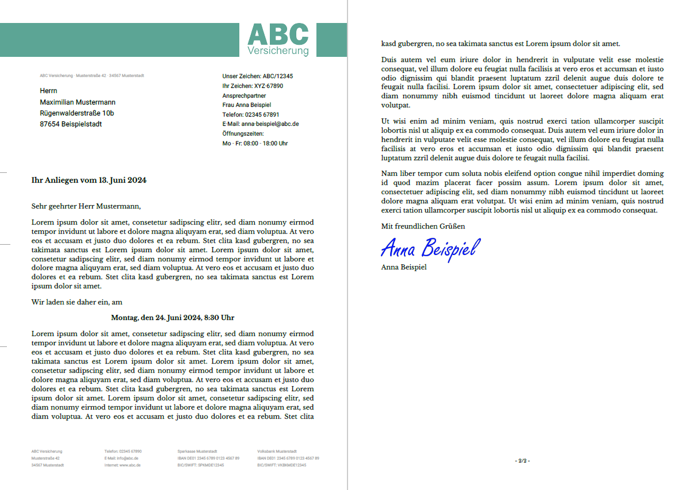
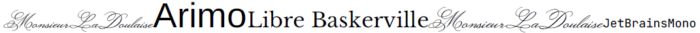
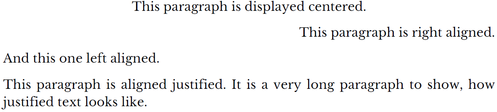
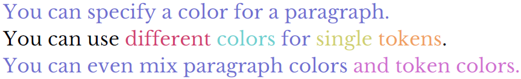
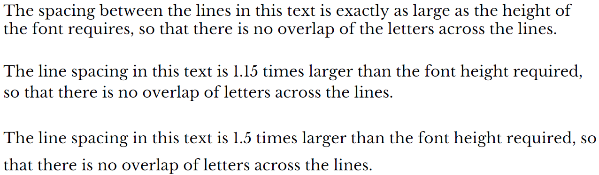
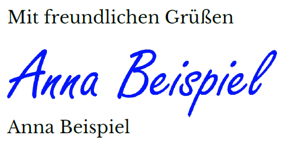

# JsPdfGen

PdfDocGen ist eine in Typescript geschriebene, template-basierte high level Library zur Generierung von PDF-Dokumenten im Front- oder Backend.
Die Generierung erfolgt dabei durch eine Definition von Templates, in denen die Struktur der Dokumente beschrieben wird (Papierformat, Ausrichtung der Seiten, Seitenränder, bedruckbare Bereiche, Grafiken, Rahmen, Logos, Kopf- und Fußzeilen, etc.).

Die Templates können dabei mehrere Sektionen beinhalten, welche verschiedene Seitenformate für einzelne Seiten des PDFs definieren. So kann z.B. bei Briefen jeweils die erste Seite des Briefs anders formatiert werden, als alle folgenden Seiten.

Für die Generierung des Dokuments muss das Template mit Inhalten befüllt werden. Diese werden abstrakt in Form von Absätzen, Sätzen, einzelnen Satzteilen und Grafiken definiert.
Die Positionierung und Ausrichtung der Texte und Grafiken innerhalb des PDF-Dokuments, so wie Zeilen- und Seitenumbrüche werden durch die Bibliothek selbst ermittelt. Als Nutzer der Bibliothek muss man also Zeilenabstände und Größen einzelner Zeilen oder Texte nicht selbst berechnen.

Auf diese Art und Weise ist es möglich auch relativ komplexe Dokumente, wie z.B. den folgenden Brief zu erstellen.

[Brief als PDF-Dokument](./examples/letter-example.pdf)  
[Quelltext zur Erstellung des Briefes](./examples/src/org/lembeck/pdfdocgen/LetterExample.ts)

## PdfDocGen unterstützt dabei unter anderem folgende Funktionen
- [Formatierung von Texten mit verschiedenen ttf-Schriftarten, auch innerhalb eines Satzes wechselnd](#formatierung-von-texten-mit-verschiedenen-ttf-schriftarten-auch-innerhalb-eines-satzes-wechselnd)
- [Links- und Rechtsbündige Ausrichtung von Absätzen, so wie Zentrierung oder Blocksatz](#links--und-rechtsbündige-ausrichtung-von-absätzen-so-wie-zentrierung-oder-blocksatz)
- [Darstellung des Textes in verschiedenen Farben](#darstellung-des-textes-in-verschiedenen-farben)
- [Definition des Zeilenabstands als Faktor abhängig von der Größe der gewählten Schrift](#definition-des-zeilenabstands-als-faktor-abhängig-von-der-größe-der-gewählten-schrift)
- [Manuelle Seiten- und Abschnittsumbrüche](#manuelle-seiten--und-abschnittsumbrüche)
- [Einbettung von Bildern](#einbettung-von-bildern)

## Beschreibung der Features

### Formatierung von Texten mit verschiedenen ttf-Schriftarten, auch innerhalb eines Satzes wechselnd.
Der Text eines Absatzes kann aus mit verschiedenen Schriftarten formatiert werden. Es können soger mehrere Schriftarten innerhalb eines Satzes oder Wortes verwendet werden:
```typescript
const mld = FontSpec.fromFile('MonsieurLaDoulaise-Regular', 'normal', 
    './fonts/MonsieurLaDoulaise/MonsieurLaDoulaise-Regular.ttf');
const content = new ContentBuilder()
 .font(mld).text("MonsieurLaDoulaise")
  .font(FontSpec.ARIMO, 24).text("Arimo")
  .font(FontSpec.LIBRE_BASKERVILLE, 14).text("Libre Baskerville")
  .font(mld).text('MonsieurLaDoulaise')
  .font(FontSpec.JETBRAINS_MONO, 8).text("JetBrainsMono")
  .font(FontSpec.LIBRE_BASKERVILLE, 12)
  .content;
```
Die einzelnen Teile des Texts werden dann je nach Schriftart und ihrer gewählten Größe an der Schrift-Baseline zueinander ausgerichtet:


### Links- und Rechtsbündige Ausrichtung von Absätzen, so wie Zentrierung oder Blocksatz.
Einzelne Absätze könne Links- oder Rechtsbündig ausgerichtet werden. Auch eine Zentrierung oder Blocksatz stehen zur Verfügung:
```typescript
const content = new ContentBuilder()
  .newParagraph().alignCenter().text('This paragraph is displayed centered.')
  .newParagraph().alignRight().text('This paragraph is right aligned.')
  .newParagraph().alignLeft().text('And this one left aligned.')
  .newParagraph().alignJustify().text('This paragraph is aligned justified. ' +
    'It is a very long paragraph to show, how justified text looks like.')
  .content;
```


### Darstellung des Textes in verschiedenen Farben.
Texte können in beliebigen Farben dargestellt werden. Dabei ist es egal, ob die Farben für ganze Absätze, Sätze, Zeilen oder einzelne Satzteile definiert werden: 
```typescript
const content = new ContentBuilder()
  .newParagraph().fontColor('#7070d0').text('You can specify a color for a paragraph.')
  .newParagraph().fontColor(undefined).text('You can use ')
  .fontColor('#d04070').text('different ')
  .fontColor('#70d0d0').text('colors ')
  .fontColor('#7070d0').text('for ')
  .fontColor('#d0d070').text('single ')
  .fontColor('#f0a060').text('tokens')
  .fontColor(undefined).text('.')
  .newParagraph().fontColor('#7070d0').text('You can even mix paragraph colors ')
  .fontColor('#d070d0').text('and token colors.')
  .content;
```


### Definition des Zeilenabstands als Faktor abhängig von der Größe der gewählten Schrift.
Der Abstand zwischen zwei Zeilen eines Absatzes orientiert sich an der gewählten Schriftart und ihrer gewählten Größe. 
Für eine angenehmere Lesbarkeit von Texten ist hilfreich, etwas größere Abstände zwischen einzelnen Zeilen einzufügen.
Dies kann mithilfe von Faktoren bewirkt werden, mit denen die Höhe einer Textzeile multipliziert wird, bevor die neue Zeile begonnen wird:
```typescript
const content = new ContentBuilder().spaceBelow(7)
  .newParagraph().lineSpacing(1)
  .text('The spacing between the lines in this text is exactly as large as the height of the font requires, so that there is no overlap of the letters across the lines.')
  .newParagraph().lineSpacing(1.15)
  .text('The line spacing in this text is 1.15 times larger than the font height required, so that there is no overlap of letters across the lines.')
  .newParagraph().lineSpacing(1.5)
  .text('The line spacing in this text is 1.5 times larger than the font height required, so that there is no overlap of letters across the lines.')
  .content;
```

### Manuelle Seiten- und Abschnittsumbrüche.
Ein Wechsel auf eine Folgeseite wird durch PdfDocGen automatisch immer dan vorgenommen, wenn beim Schreiben das Ende einer Seite erreicht 
ist und der folgende Text nicht mehr vollständig in der nächsten Zeile dargestellt werden kann.
An einigen Stellen im Text kann es allerdings auch sinnvoll sein, eine Seite im Dokument nicht komplett vollzuschreiben, sondern die Seite 
zu beenden und den folgenden Text auf der nächsten Seite zu beginnen.
An Stellen im Text, an denen sich auch das Format der Seiten ändern soll, kann auch ein Wechsel hin zum nächsten Abschnitt (section)
sinnvoll sein:

```typescript
new ContentBuilder()
  .text('Hello page one.')
  .newPage()
  .text('This is the second page.')
  .nextSection()
  .text('This is the third page. It has the format of the second section.')
  .jumpToSection('section 1')
  .text('This is the fourth page. It has the format of the first section again.')
  .content;
```

### Einbettung von Bildern
Auch Bilder können in das Dokument eingefügt werden. Sie können entweder an einer festen Position innerhalb der Formatierung einer 
Section des Templates eingefügt werden oder im Laufe des Textes. Bilder innerhalb des Texts verhalten sich, als wären sie ein eigener Absatz
innerhalb des Texts.

#### Bilder innhalb des Templates:
```typescript
const seite1 = new PdfSection('seite1', pdg.PageSize.A4, pdg.PageOrientation.PORTRAIT, seite1text, 1);
const logo = fs.readFileSync('img/abc-logo.png');
seite1.addGraphicElement(new pdg.Rectangle(0, 15, 145, 20, undefined, '#5CA595'));
seite1.addGraphicElement(new pdg.ImageElement(150, 15, 36.61, 20, logo));
seite1.addGraphicElement(new pdg.Rectangle(150 + 5 + 36.61, 15, 18.39, 20, undefined, '#5CA595'));
```

#### Bilder innerhlab des Textes
```typescript
cb.newParagraph().text('Mit freundlichen Grüßen')
  .imageParagraph(60, 15, fs.readFileSync('img/anna-beispiel.png'))
  .newParagraph().text('Anna Beispiel')
```


## FAQ
### Wie installiere ich die Library?
PdfGenDoc ist im npm-package repository hinterlegt. Die Installation erfolgt also wie gewohnt über
```
npm install pdfdocgen
```

### Gibt es Beispiele zur Verwendung der Bibliothek?
Ja, im Ordner [./examples](./examples) ist ein Beispielprojekt enthalten, in dem viele Features von PdfDocGen verwendet werden.
Die Programme liegen im Ordner [./examples/src/org/lembeck/pdfdocgen](./examples/src/org/lembeck/pdfdocgen).
Die Programme können über die Skripte in der Datei [./examples/package.json](./examples/package.json) gestartet werden.
Zum Beispiel:
```
cd examples
npm run example-letter
```

 
