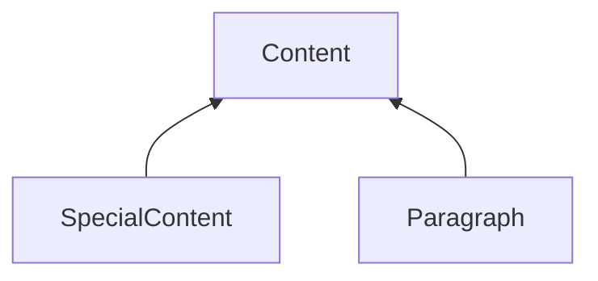
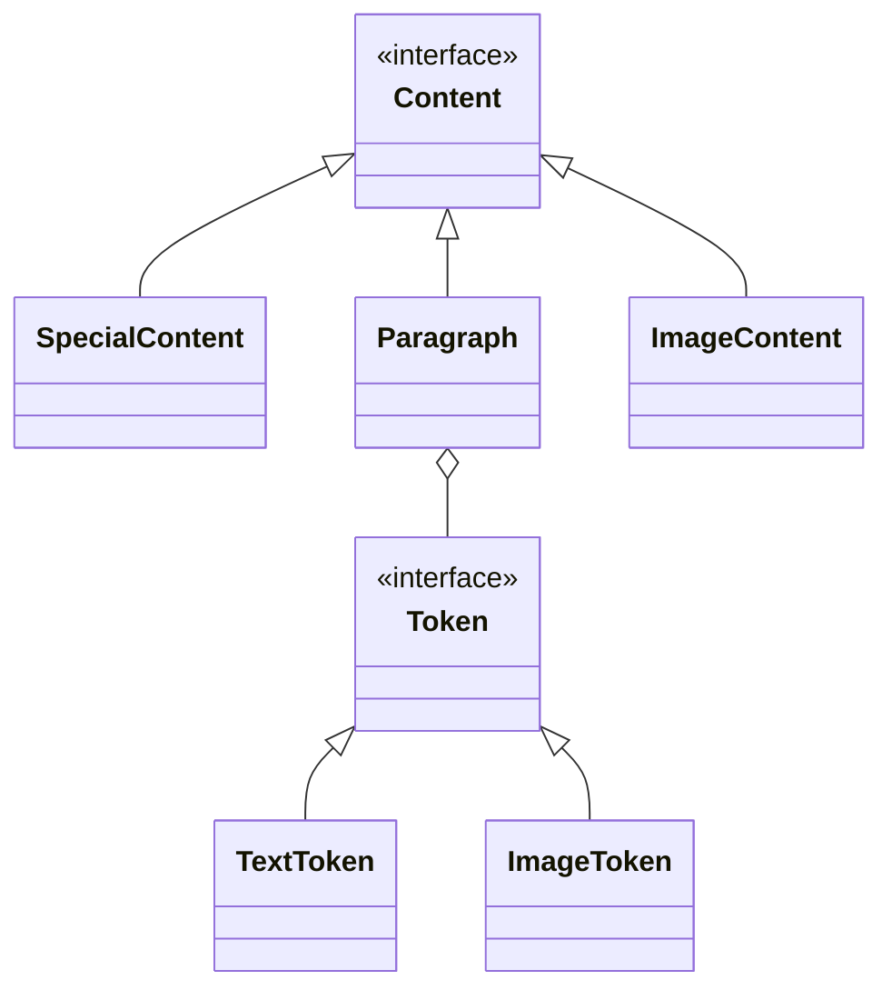

# JsPdfGen

PdfDocGen ist eine in Typescript geschriebene, template-basierte high level Library zur Generierung von PDF-Dokumenten im Front- oder Backend.
Die Generierung erfolgt dabei durch eine Definition von Templates, in denen die Struktur der Dokumente beschrieben wird (Papierformat, Ausrichtung der Seiten, Seitenränder, bedruckbare Bereiche, Grafiken, Rahmen, Logos, Kopf- und Fußzeilen, etc.).

Die Templates können dabei mehrere Sektionen beinhalten, welche verschiedene Seitenformate für einzelne Seiten des PDFs definieren. So kann z.B. bei Briefen jeweils die erste Seite des Briefs anders formatiert werden, als alle folgenden Seiten.

Für die Generierung des Dokuments muss das Template mit Inhalten befüllt werden. Diese werden abstrakt in Form von Absätzen, Sätzen, einzelnen Satzteilen und Grafiken definiert.
Die Positionierung und Ausrichtung der Texte und Grafiken innerhalb des PDF-Dokuments, so wie Zeilen- und Seitenumbrüche werden durch die Bibliothek selbst ermittelt. Als Nutzer der Bibliothek muss man also Zeilenabstände und Größen einzelner Zeilen oder Texte nicht selbst berechnen.

## PdfDocGen unterstützt dabei unter anderem folgende Funktionen
- [Formatierung von Texten mit verschiedenen ttf-Schriftarten, auch innerhalb eines Satzes wechselnd.](#formatierung-von-texten-mit-verschiedenen-ttf-schriftarten-auch-innerhalb-eines-satzes-wechselnd)
- [Links- und Rechtsbündige Ausrichtung von Absätzen, so wie Zentrierung.](#links--und-rechtsbündige-ausrichtung-von-absätzen-so-wie-zentrierung)
- [Darstellung des Textes in verschiedenen Farben.](#darstellung-des-textes-in-verschiedenen-farben)
- [Definition des Zeilenabstands als Faktor abhängig von der Größe der gewählten Schrift.](#definition-des-zeilenabstands-als-faktor-abhängig-von-der-größe-der-gewählten-schrift)
- [Manuelle Seiten- und Abschnittsumbrüche.](#manuelle-seiten--und-abschnittsumbrüche)
- [Einbettung von Bildern.](#einbettung-von-bildern)

## Beschreibung der Features

### Formatierung von Texten mit verschiedenen ttf-Schriftarten, auch innerhalb eines Satzes wechselnd.
TODO

### Links- und Rechtsbündige Ausrichtung von Absätzen, so wie Zentrierung.
TODO

### Darstellung des Textes in verschiedenen Farben.
TODO

### Definition des Zeilenabstands als Faktor abhängig von der Größe der gewählten Schrift.
TODO

### Manuelle Seiten- und Abschnittsumbrüche.
TODO

### Einbettung von Bildern

-------

- jede Section hat eine main-Content Area. Hier wird der Fließtext eingefügt.
- jede Section kann mehrere feste Areas beinhalten, in die Inhalte einer festen Länge eingefügt werden. Strukturell sind diese Inhalte für alle Seiten der Section identisch.
- eine Section gilt für eine oder mehrere Seiten.
- Abhängig vom Content kann von einer Section in die nächte gesprungen werden. Ist eine Section voll und die Anzahl ihrer Seiten erreicht, gelangt man in die nächste Section. Es gibt aber auch Befehle im Content, die einen Sprung zu einer bestimmten Section erzwingen können.

