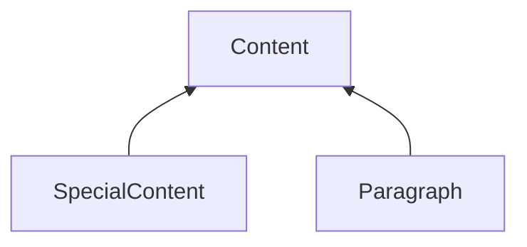
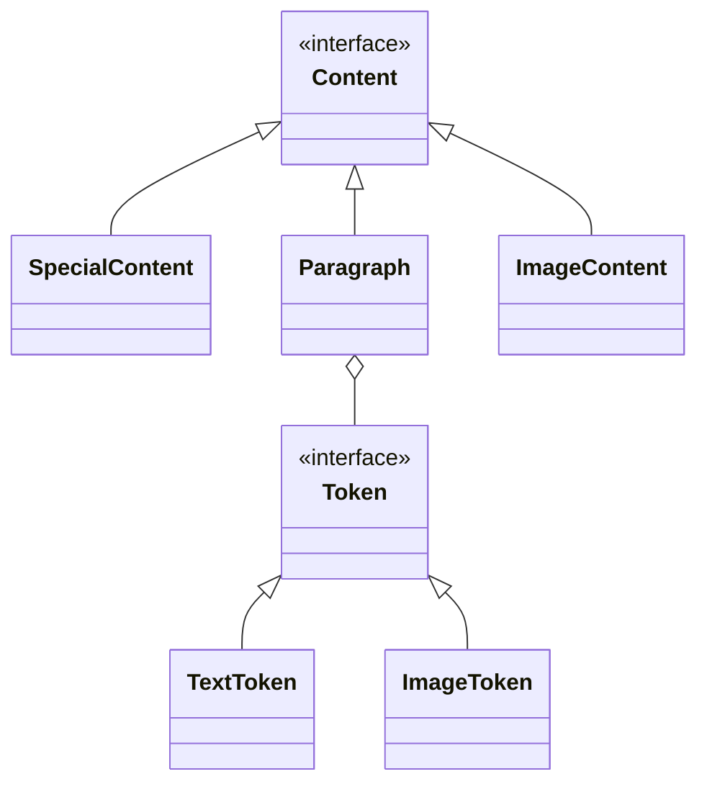

- jede Section hat eine main-Content Area. Hier wird der Fließtext eingefügt.
- jede Section kann mehrere feste Areas beinhalten, in die Inhalte einer festen Länge eingefügt werden. Strukturell sind diese Inhalte für alle Seiten der Section identisch.
- eine Section gilt für eine oder mehrere Seiten.
- Abhängig vom Content kann von einer Section in die nächte gesprungen werden. Ist eine Section voll und die Anzahl ihrer Seiten erreicht, gelangt man in die nächste Section. Es gibt aber auch Befehle im Content, die einen Sprung zu einer bestimmten Section erzwingen können.

