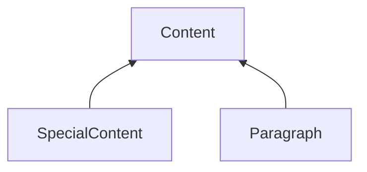
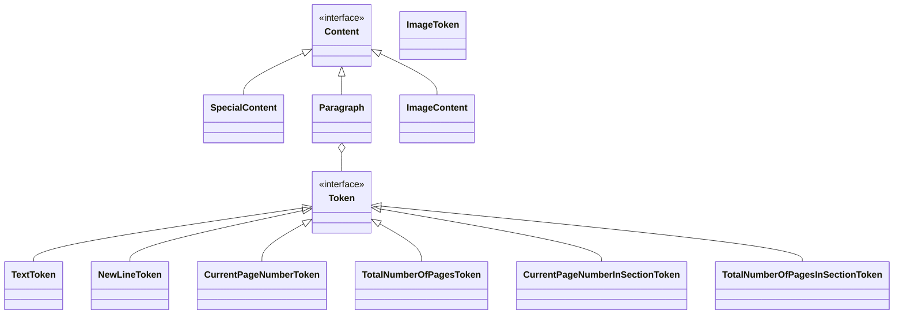

```mermaid
graph BT;
    SpecialContent-->Content
    Paragraph-->Content
```

```mermaid
classDiagram
    class Content{
       <<interface>>
    }
    class SpecialContent {
    }
    class Paragraph {
    }
    class Token {
        <<interface>>
    }
    class TextToken {
    }
    class ImageToken {
    }
    class ImageContent {
    }
    
    Content <|-- SpecialContent
    Content <|-- Paragraph
    Content <|-- ImageContent
    Paragraph o-- Token
    Token <|-- TextToken
    Token <|-- NewLineToken
    Token <|-- CurrentPageNumberToken
    Token <|-- TotalNumberOfPagesToken
    Token <|-- CurrentPageNumberInSectionToken
    Token <|-- TotalNumberOfPagesInSectionToken
    
    
```

